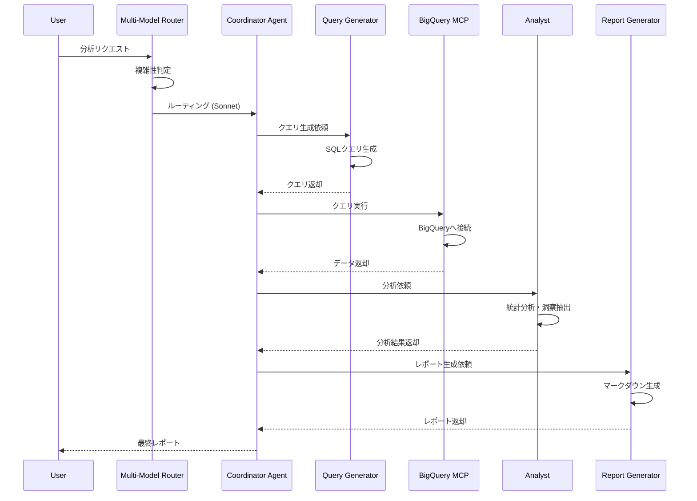

# アーキテクチャ設計書

## 1. システムアーキテクチャ

### 1.1 レイヤー構成

```
┌─────────────────────────────────────────────────────────────────┐
│                      プレゼンテーション層                         │
│  ┌─────────────┐  ┌─────────────┐  ┌─────────────┐            │
│  │   Slack     │  │  REST API   │  │    CLI      │            │
│  │   Bot       │  │  Endpoint   │  │  Interface  │            │
│  └─────────────┘  └─────────────┘  └─────────────┘            │
└─────────────────────────────────────────────────────────────────┘
                              │
                              ▼
┌─────────────────────────────────────────────────────────────────┐
│                    オーケストレーション層                         │
│                     (agentic-flow)                               │
│  ┌────────────────────────────────────────────────────────────┐│
│  │               Request Router & Dispatcher                  ││
│  └────────────────────────────────────────────────────────────┘│
│  ┌────────────────────────────────────────────────────────────┐│
│  │                 Multi-Model Router                         ││
│  │  • Complexity Analyzer    • Cost Optimizer                 ││
│  │  • Quality Validator      • Fallback Handler               ││
│  └────────────────────────────────────────────────────────────┘│
│  ┌────────────────────────────────────────────────────────────┐│
│  │                   SONA Engine                              ││
│  │  • Pattern Learning       • LoRA Fine-tuning               ││
│  │  • GNN Query Refinement   • ReasoningBank                  ││
│  └────────────────────────────────────────────────────────────┘│
└─────────────────────────────────────────────────────────────────┘
                              │
                              ▼
┌─────────────────────────────────────────────────────────────────┐
│                       エージェント層                             │
│  ┌─────────────┐  ┌─────────────┐  ┌─────────────┐            │
│  │ Query Gen   │  │  Analysis   │  │  Report     │            │
│  │   Agent     │  │   Agent     │  │   Agent     │            │
│  └─────────────┘  └─────────────┘  └─────────────┘            │
│  ┌─────────────┐  ┌─────────────┐  ┌─────────────┐            │
│  │ Validation  │  │  Insight    │  │ Coordinator │            │
│  │   Agent     │  │   Agent     │  │   Agent     │            │
│  └─────────────┘  └─────────────┘  └─────────────┘            │
└─────────────────────────────────────────────────────────────────┘
                              │
                              ▼
┌─────────────────────────────────────────────────────────────────┐
│                        MCP 層                                   │
│  ┌─────────────┐  ┌─────────────┐  ┌─────────────┐            │
│  │  BigQuery   │  │    GA4      │  │   Custom    │            │
│  │ MCP Server  │  │ MCP Server  │  │ MCP Server  │            │
│  └─────────────┘  └─────────────┘  └─────────────┘            │
└─────────────────────────────────────────────────────────────────┘
                              │
                              ▼
┌─────────────────────────────────────────────────────────────────┐
│                       データソース層                             │
│  ┌─────────────┐  ┌─────────────┐  ┌─────────────┐            │
│  │  BigQuery   │  │    GA4      │  │   Other     │            │
│  │  Datasets   │  │  Property   │  │  Sources    │            │
│  └─────────────┘  └─────────────┘  └─────────────┘            │
└─────────────────────────────────────────────────────────────────┘
```

### 1.2 コンポーネント詳細

#### 1.2.1 Multi-Model Router

タスクの複雑性を自動判定し、最適なLLMにルーティングする。

```typescript
interface RoutingConfig {
  tiers: {
    simple: {
      complexity: [0.0, 0.3];
      model: 'gemini-1.5-flash';
      costPer1MTokens: 0;
      useCases: ['フォーマット', 'シンプルなクエリ', 'データ変換'];
    };
    moderate: {
      complexity: [0.3, 0.6];
      model: 'claude-3-5-haiku';
      costPer1MTokens: 0.25;
      useCases: ['基本分析', 'SQL生成', 'サマリー作成'];
    };
    complex: {
      complexity: [0.6, 0.8];
      model: 'claude-3-5-sonnet';
      costPer1MTokens: 3;
      useCases: ['複合分析', 'トレンド解析', 'クロス分析'];
    };
    expert: {
      complexity: [0.8, 1.0];
      model: 'claude-opus-4-5';
      costPer1MTokens: 15;
      useCases: ['高度な洞察抽出', '予測分析', '戦略提案'];
    };
  };
}
```

**複雑性判定アルゴリズム:**

```typescript
function analyzeComplexity(task: AnalysisTask): number {
  let score = 0;

  // データソース数
  score += task.dataSources.length * 0.1;

  // 分析期間の長さ
  score += Math.min(task.dateRange.days / 365, 0.2);

  // 必要な集計の複雑性
  score += task.aggregations.length * 0.05;

  // クロス分析の有無
  if (task.requiresCrossAnalysis) score += 0.15;

  // 予測・推論の要求
  if (task.requiresPrediction) score += 0.2;

  // 洞察抽出の深さ
  score += task.insightDepth * 0.1;

  return Math.min(score, 1.0);
}
```

#### 1.2.2 SONA Engine

自己最適化ニューラルアーキテクチャによる継続的学習システム。

```typescript
interface SONAConfig {
  learning: {
    enabled: true;
    overhead: '<1ms';
    profiles: {
      'real-time': { opsPerSec: 2200, latency: '<0.5ms' };
      'batch': { opsPerSec: 1500, latency: '5ms' };
      'research': { qualityImprovement: '+55%', latency: '18ms' };
    };
  };

  reasoningBank: {
    // 過去の分析パターンを蓄積
    patterns: {
      queryPatterns: Map<string, QueryPattern>;
      analysisPatterns: Map<string, AnalysisPattern>;
      insightPatterns: Map<string, InsightPattern>;
    };
    retention: {
      shortTerm: '24h';
      longTerm: '30d';
    };
  };

  gnnQueryRefinement: {
    enabled: true;
    recallImprovement: '+12.4%';
    layers: 3;
  };
}
```

#### 1.2.3 エージェント構成

```typescript
// 分析用エージェント定義
const analysisAgents = {
  queryGenerator: {
    name: 'query-generator',
    description: 'BigQuery/GA4用のクエリを生成',
    tools: ['bigquery_query_builder', 'ga4_query_builder'],
    preferredModel: 'claude-3-5-sonnet',
    learningEnabled: true,
  },

  dataFetcher: {
    name: 'data-fetcher',
    description: 'MCPを通じてデータを取得',
    tools: ['mcp_bigquery_execute', 'mcp_ga4_fetch'],
    preferredModel: 'claude-3-5-haiku',
    learningEnabled: false,
  },

  analyst: {
    name: 'analyst',
    description: 'データを分析して洞察を抽出',
    tools: ['statistical_analysis', 'trend_detection'],
    preferredModel: 'claude-3-5-sonnet',
    learningEnabled: true,
  },

  insightExtractor: {
    name: 'insight-extractor',
    description: '高度な洞察と提案を生成',
    tools: ['insight_synthesis', 'recommendation_engine'],
    preferredModel: 'claude-opus-4-5',
    learningEnabled: true,
  },

  reportGenerator: {
    name: 'report-generator',
    description: 'レポートを生成・フォーマット',
    tools: ['markdown_generator', 'chart_generator'],
    preferredModel: 'claude-3-5-haiku',
    learningEnabled: false,
  },

  coordinator: {
    name: 'coordinator',
    description: 'エージェント間の調整・オーケストレーション',
    tools: ['agent_dispatch', 'result_aggregation'],
    preferredModel: 'claude-3-5-sonnet',
    learningEnabled: true,
  },
};
```

---

## 2. データフロー

### 2.1 分析リクエストフロー

```
┌─────────┐     ┌─────────────┐     ┌─────────────┐     ┌─────────┐
│ Request │────▶│ Coordinator │────▶│Query Gen    │────▶│BigQuery │
│         │     │   Agent     │     │  Agent      │     │MCP      │
└─────────┘     └─────────────┘     └─────────────┘     └─────────┘
                      │                                       │
                      │              ┌─────────────┐          │
                      │◀─────────────│ Data        │◀─────────┘
                      │              │ Fetcher     │
                      │              └─────────────┘
                      │
                      ▼
               ┌─────────────┐     ┌─────────────┐
               │  Analyst    │────▶│  Insight    │
               │   Agent     │     │  Extractor  │
               └─────────────┘     └─────────────┘
                                         │
                                         ▼
                                  ┌─────────────┐     ┌─────────┐
                                  │  Report     │────▶│Response │
                                  │  Generator  │     │         │
                                  └─────────────┘     └─────────┘
```

### 2.2 シーケンス図



---

## 3. 状態管理

### 3.1 セッション状態

```typescript
interface AnalysisSession {
  id: string;
  createdAt: Date;
  status: 'pending' | 'running' | 'completed' | 'failed';

  request: {
    originalQuery: string;
    parsedIntent: AnalysisIntent;
    dataSources: DataSource[];
  };

  execution: {
    currentAgent: string;
    completedSteps: ExecutionStep[];
    pendingSteps: ExecutionStep[];
    errors: Error[];
  };

  results: {
    rawData: Record<string, unknown>[];
    analysis: AnalysisResult;
    insights: Insight[];
    report: string;
  };

  metrics: {
    tokensUsed: {
      input: number;
      output: number;
    };
    costEstimate: number;
    latencyMs: number;
  };

  learning: {
    patternsLearned: Pattern[];
    reasoningBankUpdates: ReasoningUpdate[];
  };
}
```

### 3.2 永続化

```typescript
interface PersistenceConfig {
  // セッション状態
  sessions: {
    backend: 'redis' | 'sqlite';
    ttl: '24h';
  };

  // 学習パターン
  learningPatterns: {
    backend: 'sqlite' | 'postgresql';
    retention: '90d';
  };

  // メトリクス
  metrics: {
    backend: 'prometheus' | 'cloudwatch';
    resolution: '1m';
  };
}
```

---

## 4. スケーラビリティ設計

### 4.1 水平スケーリング

```
                    ┌─────────────────┐
                    │  Load Balancer  │
                    └────────┬────────┘
                             │
        ┌────────────────────┼────────────────────┐
        │                    │                    │
        ▼                    ▼                    ▼
┌───────────────┐   ┌───────────────┐   ┌───────────────┐
│  Instance 1   │   │  Instance 2   │   │  Instance 3   │
│ agentic-flow  │   │ agentic-flow  │   │ agentic-flow  │
└───────────────┘   └───────────────┘   └───────────────┘
        │                    │                    │
        └────────────────────┼────────────────────┘
                             │
                    ┌────────┴────────┐
                    │  Shared State   │
                    │    (Redis)      │
                    └─────────────────┘
```

### 4.2 リソース要件

| コンポーネント | CPU | メモリ | ストレージ |
|--------------|-----|--------|-----------|
| agentic-flow インスタンス | 2 vCPU | 4 GB | 20 GB |
| Redis (状態管理) | 1 vCPU | 2 GB | 10 GB |
| SQLite (学習DB) | 1 vCPU | 1 GB | 50 GB |

### 4.3 同時実行制限

```typescript
interface ConcurrencyLimits {
  // 同時分析セッション数
  maxConcurrentSessions: 10;

  // エージェントごとの同時実行数
  agentConcurrency: {
    'query-generator': 5;
    'data-fetcher': 3;  // BigQueryのクォータに合わせる
    'analyst': 5;
    'insight-extractor': 2;  // Opusは高コストのため制限
    'report-generator': 10;
  };

  // MCPサーバーごとの同時接続数
  mcpConcurrency: {
    'bigquery': 5;
    'ga4': 5;
  };
}
```

---

## 5. エラーハンドリング

### 5.1 リトライ戦略

```typescript
interface RetryStrategy {
  // LLM API エラー
  llmApiError: {
    maxRetries: 3;
    backoff: 'exponential';
    baseDelayMs: 1000;
    maxDelayMs: 30000;
  };

  // BigQuery エラー
  bigqueryError: {
    maxRetries: 2;
    backoff: 'linear';
    baseDelayMs: 5000;
  };

  // タイムアウト
  timeout: {
    queryExecution: 120000;  // 2分
    analysis: 180000;        // 3分
    totalSession: 600000;    // 10分
  };
}
```

### 5.2 フォールバック

```typescript
interface FallbackConfig {
  // モデルフォールバック
  modelFallback: {
    'claude-opus-4-5': ['claude-3-5-sonnet', 'claude-3-5-haiku'];
    'claude-3-5-sonnet': ['claude-3-5-haiku', 'gemini-1.5-pro'];
    'claude-3-5-haiku': ['gemini-1.5-flash'];
  };

  // データソースフォールバック
  dataSourceFallback: {
    // BigQueryダウン時はキャッシュから取得
    bigquery: 'cached_data';
  };
}
```

---

## 6. 監視・可観測性

### 6.1 メトリクス

```typescript
interface Metrics {
  // パフォーマンス
  performance: {
    requestLatencyMs: Histogram;
    tokensPerRequest: Histogram;
    costPerRequest: Histogram;
  };

  // 使用状況
  usage: {
    activeSessionsCount: Gauge;
    requestsPerMinute: Counter;
    errorRate: Counter;
  };

  // モデル使用状況
  modelUsage: {
    requestsByModel: Counter;
    tokensByModel: Counter;
    costByModel: Counter;
  };

  // 学習
  learning: {
    patternsLearned: Counter;
    queryRefinementImprovement: Gauge;
  };
}
```

### 6.2 ログ構造

```typescript
interface LogEntry {
  timestamp: string;
  level: 'debug' | 'info' | 'warn' | 'error';
  sessionId: string;
  agentName: string;
  event: string;
  metadata: {
    model?: string;
    tokens?: { input: number; output: number };
    latencyMs?: number;
    error?: string;
  };
}
```
